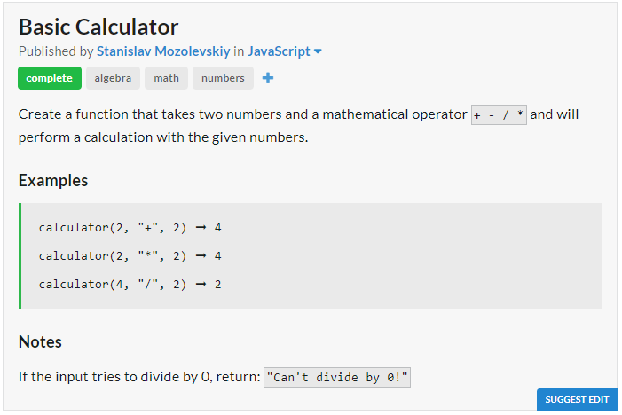
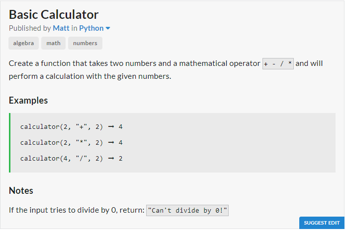

# JavaScript Solution

```javascript
const calculator = (num1, operator, num2) => {
	switch (operator) {
		case '+' : return num1 + num2;
		case '-' : return num1 - num2;
		case '*' : return num1 * num2;
		case '/' : return num2 === 0 ? "Can't divide by 0!" : num1 / num2;
	}
};
```
# Python Solution

```python
def calculator(num1, operator, num2):
	return {
		"+" : num1 + num2,
		"-" : num1 - num2,
		"*" : num1 * num2,
		"/" : num1 // num2 if num2 else "Can't divide by 0!"
	}[operator]
```
