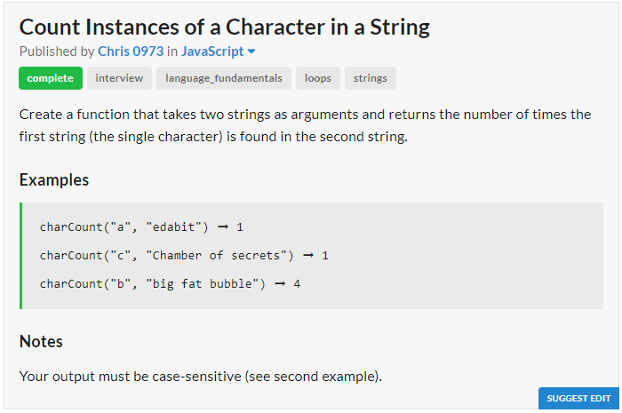
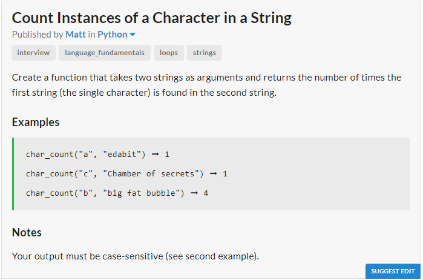

# JavaScript Solution

```javascript
const charCount = (myChar, str) => {
	let cnt = 0;
	for (let i of str)
		if (i === myChar)
			cnt++;
	return cnt;
};
// return [...str].filter(x => x == myChar).length;
```
# Python Solution

```python
def char_count(txt1, txt2):
	cnt = 0
	for i in txt2:
		if i == txt1:
			cnt += 1
	return cnt
	# return len(list(filter(lambda x : x == txt1, txt2)))
	# return txt2.count(txt1)
```
