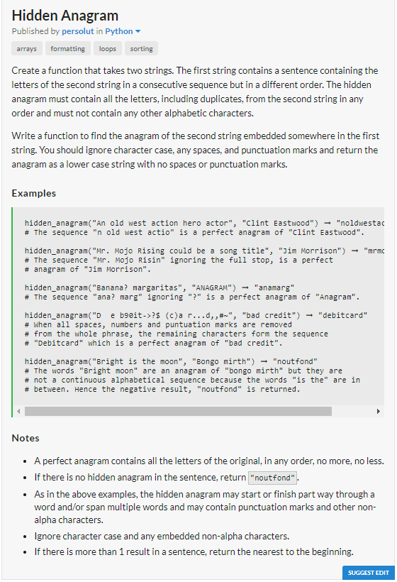

# JavaScript Solution

```javascript
const hiddenAnagram = (text, phrase) => {
    const sorted = [...phrase.toLowerCase()].filter((char) => /[a-zA-Z]/.test(char)).sort().join('') ;
    const filteredText = [...text].filter((char) => /[a-zA-Z]/.test(char)).join('').toLowerCase() ;
    for( let i =  0; i + sorted.length <= filteredText.length ; ++i ) {
        const currentString = filteredText.slice(i, i + sorted.length ) ;
        const sortedCurrentString = [...currentString].sort().join('').toLowerCase() ;
        if (sortedCurrentString === sorted )
            return currentString ;
    }

    return "noutfond";
};
```
# Python Solution

```python
def hidden_anagram(text, phrase):
	sortedPhrase = "".join(filter(lambda x : x.isalpha() ,sorted(phrase.lower())))
	filteredText = "".join(filter(lambda x : x.isalpha(), text.lower()))
	for i in range(0,len(filteredText)-len(sortedPhrase)+1):
		currentString = filteredText[i:i+len(sortedPhrase)]
		sortedCurrentString = "".join(sorted(currentString.lower()))
		if sortedCurrentString == sortedPhrase:
			return currentString
	return "noutfond"
```
