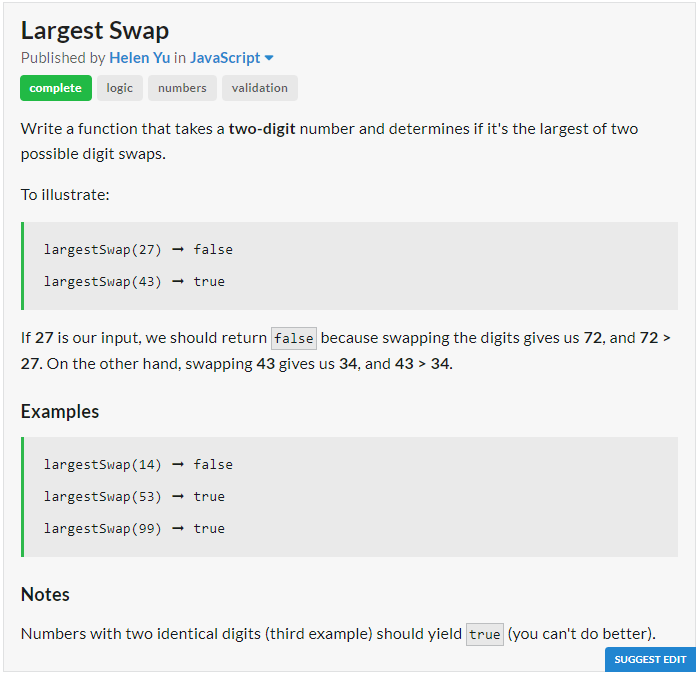
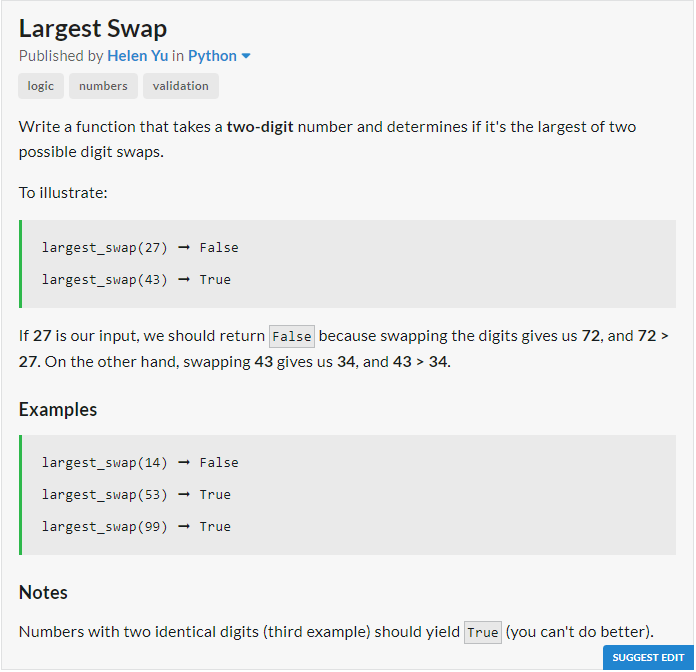

# JavaScript Solution

```javascript
const largestSwap = num => {
	let temp = num, rev = 0;
	while (temp > 0){
		rev = (rev * 10) + (temp % 10);
		temp -= rev % 10;
		temp /= 10;
		//Last 2 Lines Can Be Replaced By
		//temp = Math.floor(temp/10);
	}
	return num >= rev;
};
```
# Python Solution

```python
def largest_swap(num):
	temp = num
	rev = 0
	while temp > 0:
		rev = (rev * 10) + (temp % 10)
		temp //= 10
	return num >= rev
```
