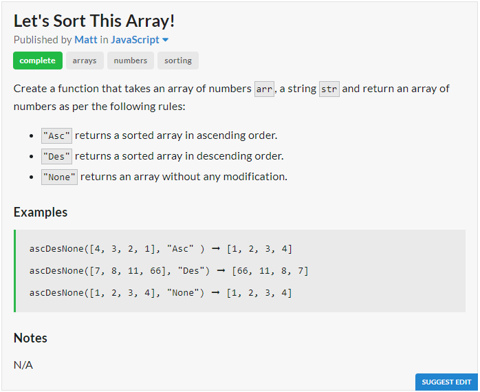
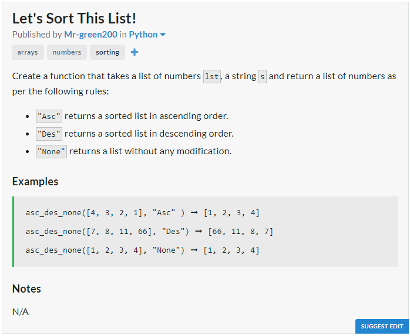

# JavaScript Solution

```javascript
const ascDesNone = (arr, str) => str == "Asc" 
			? arr.sort((a, b) => a - b) 
			: str == "Des" 
			? arr.sort((a, b) => b - a) 
			: arr;
```
# Python Solution

```python
def asc_des_none(lst, s):
	return sorted(lst) if s == "Asc" else sorted(lst)[::-1] if s == "Des" else lst
```
