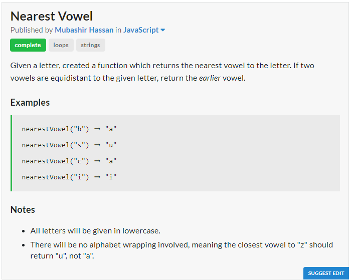
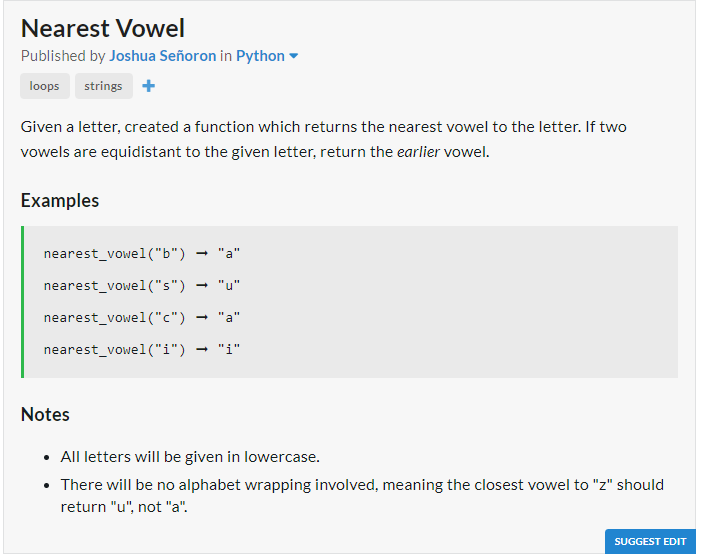

# JavaScript Solution

```javascript
const nearestVowel = s => {
	let near, i;
	s = s.charCodeAt(0);
	i = Math.abs(s - 97);
	near = "a";
	if (Math.abs(s - 101) < i){
		i = Math.abs(s - 101);
		near = "e";
	}
	if (Math.abs(s - 105) < i){
		i = Math.abs(s - 105);
		near = "i";
	}
	if (Math.abs(s - 111) < i){
		i = Math.abs(s - 111);
		near = "o";
	}
	if (Math.abs(s - 117) < i){
		i = Math.abs(s - 117);
		near = "u";
	}
	return near;
};
```
# Python Solution

```python
def nearest_vowel(s):
	s = ord(s)
	i = abs(s - 97)
	near = "a"
	if abs(s - 101) < i:
		i = abs(s - 101)
		near = "e"
	if abs(s - 105) < i:
		i = abs(s - 105)
		near = "i"
	if abs(s - 111) < i:
		i = abs(s - 111)
		near = "o"
	if abs(s - 117) < i:
		i = abs(s - 117)
		near = "u"
	return near
```
