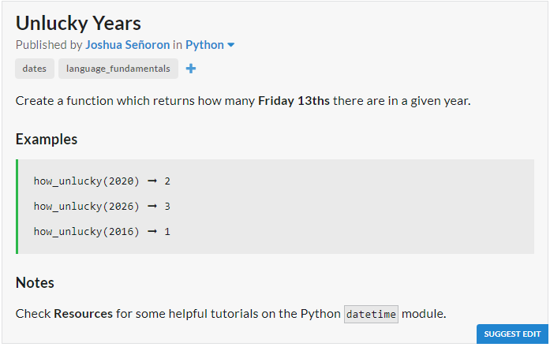

# JavaScript Solution

```javascript
const howUnlucky = y => [0,1,2,3,4,5,6,7,8,9,10,11]
							.filter(m => new Date(y,m,13).getDay() == 5).length;
```
# Python Solution

```python
from datetime import datetime
def how_unlucky(y):
	return len(list(filter(lambda x: datetime(y,x,13).strftime("%w") == "5",range(1, 13))))
```