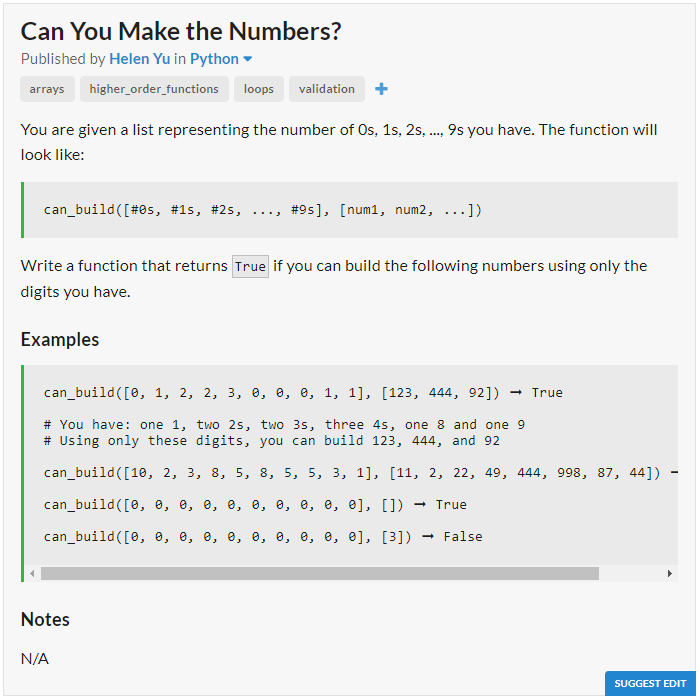

# JavaScript Solution

```javascript
const canBuild = (digits, arr) => {
	let digit;
	for (let num of arr){
		if (num == 0)
		digits[num] -= 1;
		while (num != 0){
			digit = num % 10;
			digits[digit] -= 1;
			num -= digit;
			num /= 10;
		}
		if (digits.some(i => i < 0) == true)
		return false;
	}
	return true;
};
```
# Python Solution

```python
def can_build(digits, lst):
	for num in lst:
		if not num:
			digits[num] -= 1
		while num != 0:
			digits[num%10] -= 1
			num //= 10
		for cnt in digits:
			if cnt < 0:
				return False
	return True
```
