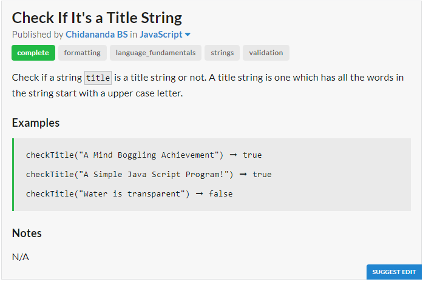
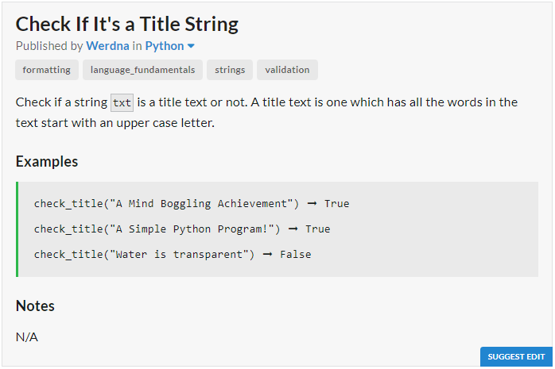

# JavaScript Solution

```javascript
const checkTitle = title => title.split(" ").every(word => word[0] == word[0].toUpperCase());
```
# Python Solution

```python
def check_title(txt):
	return all(map((lambda x : x[0].isupper()), txt.split()))
```
