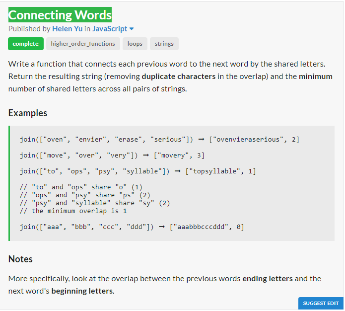
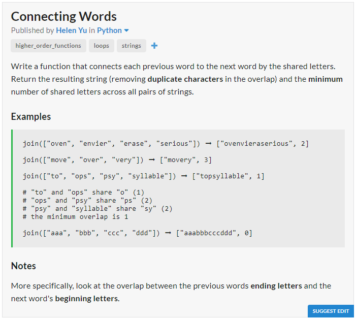

# JavaScript Solution

```javascript
const longestCommon = (prevStr, currStr) => {
	let max = 0, j = 0;
	for (let i in prevStr){
		if (prevStr[i] == currStr[j])
		j += 1;
		else{
			max = j > max ? j : max;
			j = 0;
			if (prevStr[i] == currStr[j])
			j += 1;
		}
	}
	return j > max ? j : max;
};
const join = arr => {
	let ans = arr[0], min = 10000, len;
	for (let i = 1; i < arr.length; i += 1){
		len = longestCommon(arr[i-1],arr[i]);
		ans += [...arr[i]].slice(len).join("");
		min = min < len ? min : len;
	}
	return [ans, min];
```
# Python Solution

```python
def longestCommon(prevStr, currStr):
	maxLen = j = 0
	for i in range(len(prevStr)):
		if prevStr[i] == currStr[j]:
			j += 1
		else:
			maxLen = j if j > maxLen else maxLen
			j = 0
			if prevStr[i] == currStr[j]:
				j += 1
	return j if j > maxLen else maxLen

def join(lst):
	ans = lst[0]
	minLen = 10000
	for i in range(1,len(lst)):
		length = longestCommon(lst[i-1],lst[i])
		ans += lst[i][length:]
		minLen = minLen if minLen < length else length
	return [ans, minLen]
```
