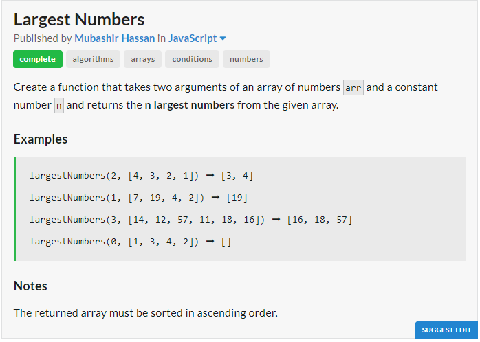
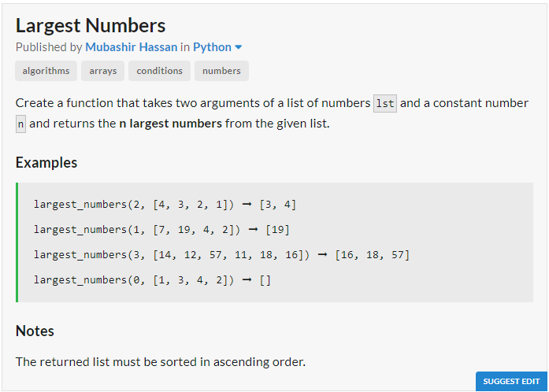

# JavaScript Solution

```javascript
const largestNumbers = (n, arr) => n == 0 ? [] : arr.sort((a,b) => a - b).slice(-n);
```
# Python Solution

```python
def largest_numbers(n, lst):
	return sorted(lst)[-n:] if n > 0 else []
```
