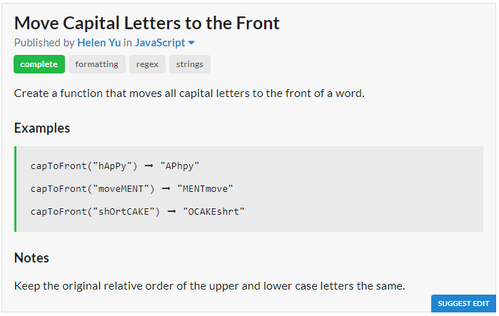
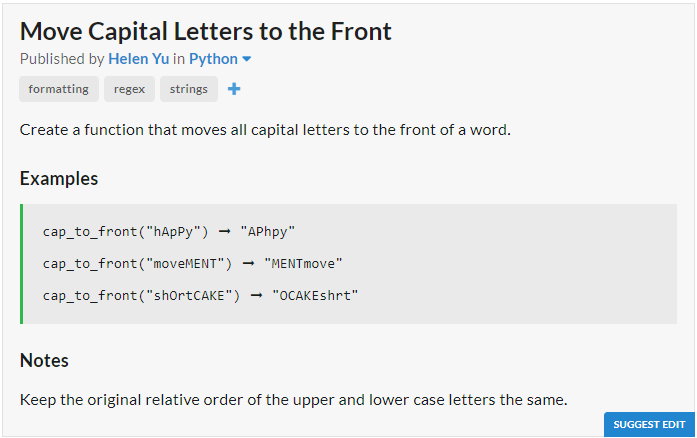

# JavaScript Solution

```javascript
const capToFront = s => {
	let lowerCase = "", upperCase = "";
	for (let i of s){
		if (i == i.toLowerCase())
		lowerCase += i;
		else
		upperCase += i
	}
	return upperCase + lowerCase;
};
```
# Python Solution

```python
def cap_to_front(s):
	upperCase = lowerCase = ""
	for i in s:
		if i.isupper():
			upperCase += i
		else:
			lowerCase += i
	return upperCase + lowerCase
```
