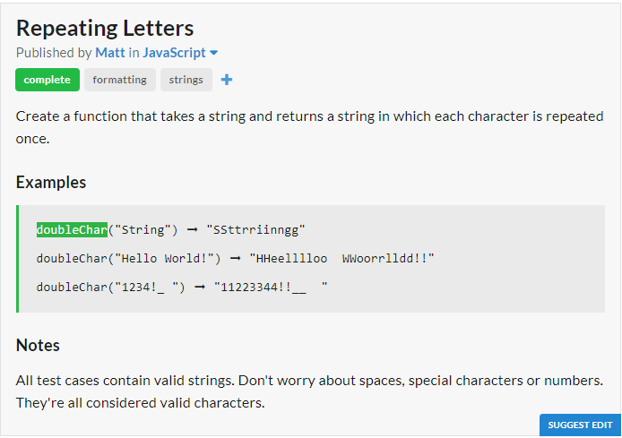
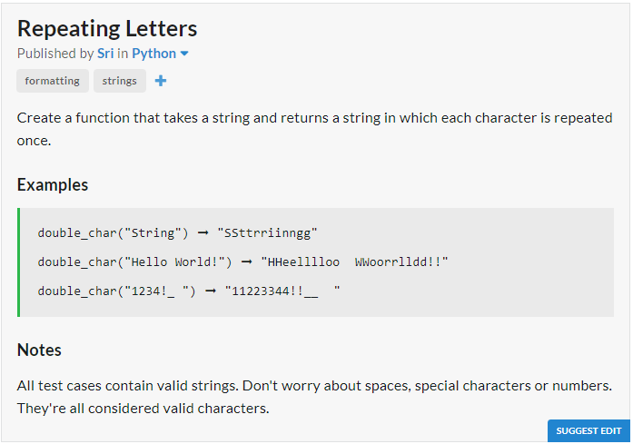

# JavaScript Solution

```javascript
const doubleChar = str => str.split("").map(i => i+i).join("");
```
# Python Solution

```python
def double_char(txt):
	return "".join(map(lambda x : x + x, txt))
```
