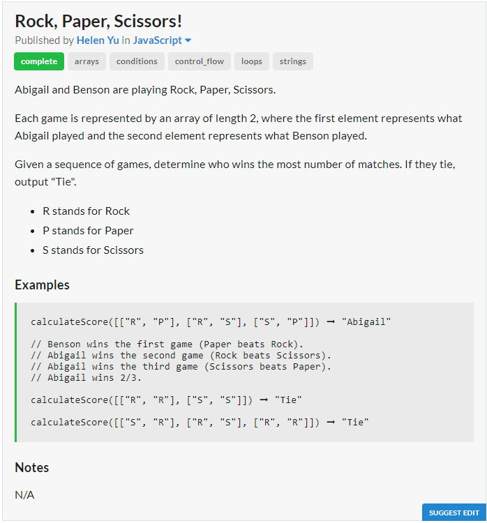
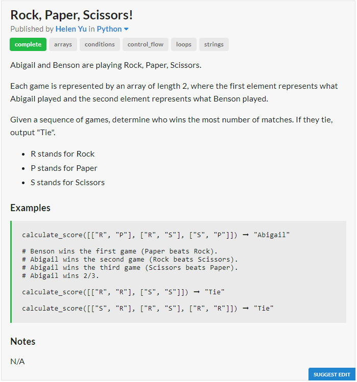

# JavaScript Solution

```javascript
const calculateScore = games => {
	let abigail = 0, benson = 0;
	for (let [a, b] of games){
		if (a == b)
		continue;
		else if (a == "P"){
			if (b == "R")
			abigail += 1;
			else
			benson += 1;
		}
		else if (a == "R"){
			if (b == "S")
			abigail += 1;
			else
			benson += 1;
		}
		else{
			if (b == "P")
			abigail += 1;
			else
			benson += 1;
		}
	}
	return abigail > benson ? "Abigail" : benson > abigail ? "Benson" : "Tie";
};
```
# Python Solution

```python
def calculate_score(games):
	abigail = benson = 0
	for a, b in games:
		if a == b:
			continue
		elif a == "P":
			if b == "R":
				abigail += 1
			else:
				benson += 1
		elif a == "R":
			if b == "S":
				abigail += 1
			else:
				benson += 1
		else:
			if b == "P":
				abigail += 1
			else:
				benson += 1
	return "Abigail" if abigail > benson else "Benson" if benson > abigail else "Tie"
```
