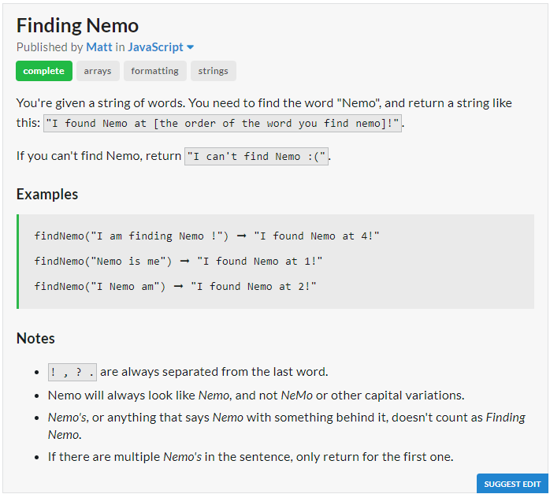

# Question

# JavaScript Solution
```javascript
const findNemo = s => s.split(" ").indexOf("Nemo") != -1 
? `I found Nemo at ${1+s.split(" ").findIndex(x => x == "Nemo")}!` 
: "I can't find Nemo :(";
```
# Python Solution
```python
def find_nemo(sentence):
	try:
		ans = sentence.split().index("Nemo")
		return "I found Nemo at {}!".format(ans+1)
	except:
		return "I can't find Nemo :("
```