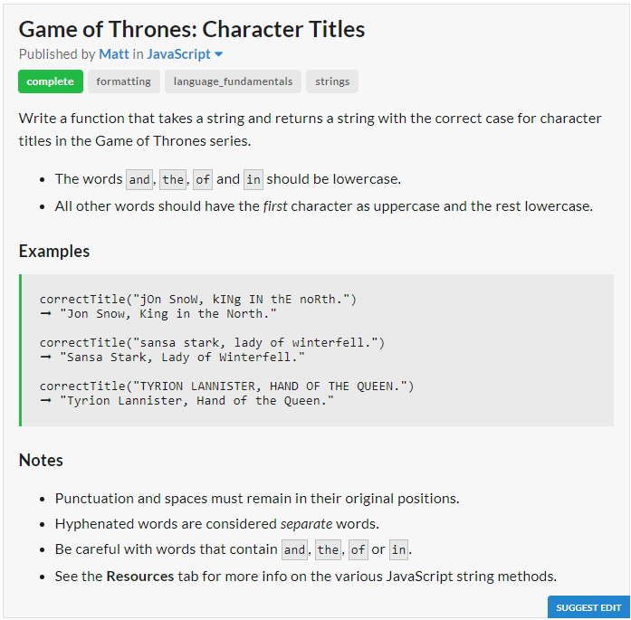

# Question

# JavaScript Solution
```javascript
const correctTitle = title => {
	title = title.split(" ");
	for (let i in title){
		if ("and the of in"
				.indexOf(title[i]
				.toLowerCase()) > -1)
		title[i] = title[i].toLowerCase();
		else{
			if(title[i]
				 .indexOf("-") == -1)
			title[i] = title[i][0].toUpperCase() 
				 + title[i].slice(1).toLowerCase();
			else
				title[i] = title[i].split("-")
					.map(w => "and the of in".indexOf(w.toLowerCase())>-1 
					? w.toLowerCase() 
					: w[0].toUpperCase()+w.slice(1).toLowerCase()).join("-");
		}
	}
	return title.join(" ");
};
```
# Python Solution
```python
def correct_title(txt):
	def func(x):
		if x in "and the of in":
			return x
		else:
			if "-" in x:
				return "-".join(map(func,x.split("-")))
			else:
				return x[0].upper() + x[1:]
	return " ".join(map(func,txt.lower().split(" ")))
```