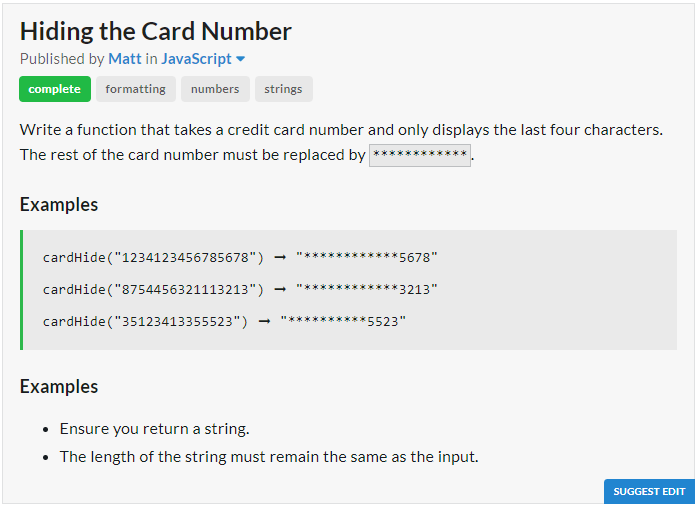

# Question

# JavaScript Solution
```javascript
const cardHide = card => `${card.slice(-4).padStart(card.length,"*")}`;
```
# Python Solution
```python
def card_hide(card):
	return card[-4:].rjust(len(card),"*")
```