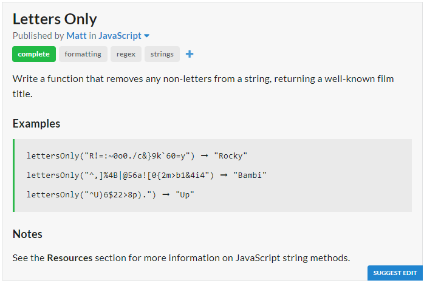

# Question

# JavaScript Solution
```javascript
const lettersOnly = s => s.match(/[A-Z]/gi).join("");
```
# Python Solution
```python
letters_only = lambda x : "".join(filter(lambda y : y.isalpha(),x))
```