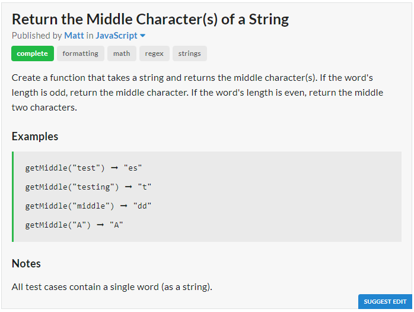

# Question

# JavaScript Solution
```javascript
const getMiddle = x => x.length % 2 != 0 ? x.substr(x.length/2,1) : x.substr((x.length/2)-1,2);
```
# Python Solution
```python
get_middle = lambda x : x[len(x)//2] if len(x)%2 else x[(len(x)//2)-1:(len(x)//2)+1]
```