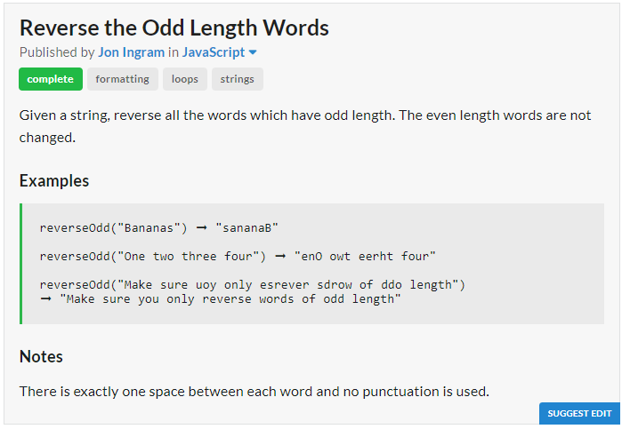

# Question

# JavaScript Solution
```javascript
const reverseOdd = x => x.split(" ").map(w => w.length%2==0 ? 
	w : [...w].reverse().join("")).join(" ");
```
# Python Solution
```python
reverse_odd = lambda x : " ".join(map(lambda w : w[::-1] if len(w) % 2 else w,x.split(" ")))
```