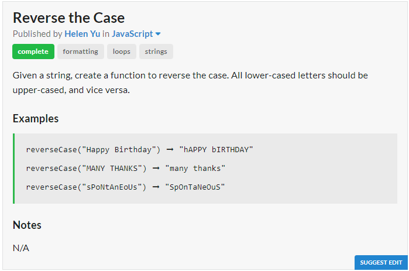

# Question

# JavaScript Solution
```javascript
const reverseCase = s => [...s].map(i => i == i.toUpperCase() ? i.toLowerCase() : i.toUpperCase()).join("");
```
# Python Solution
```python
reverse_case = lambda x : x.swapcase()
```