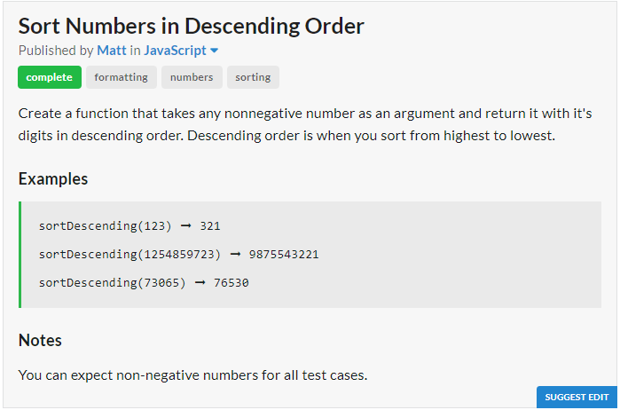

# Question

# JavaScript Solution
```javascript
const sortDescending = n => parseInt([...n.toString()].sort().reverse().join(""))
```
# Python Solution
```python
sort_descending = lambda x : int("".join(sorted(str(x)))[::-1])
```